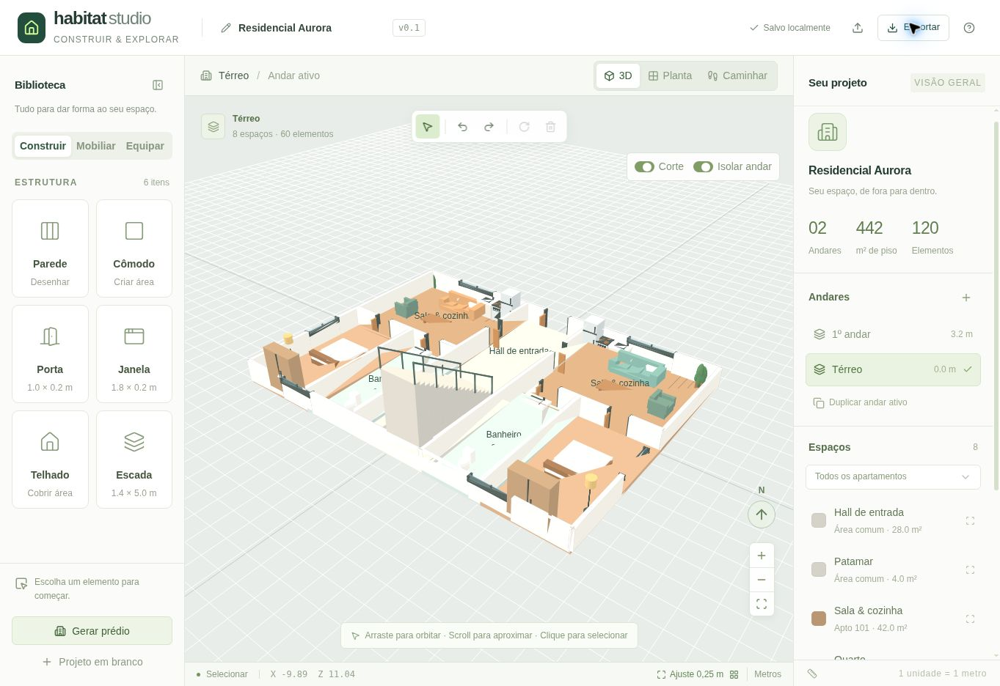
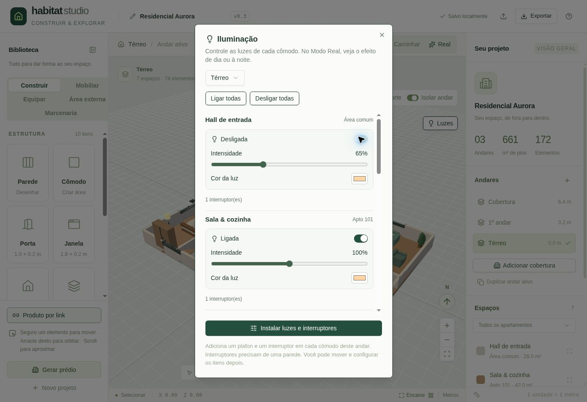
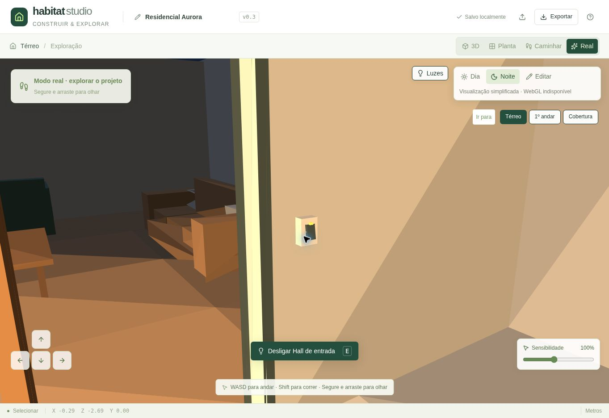
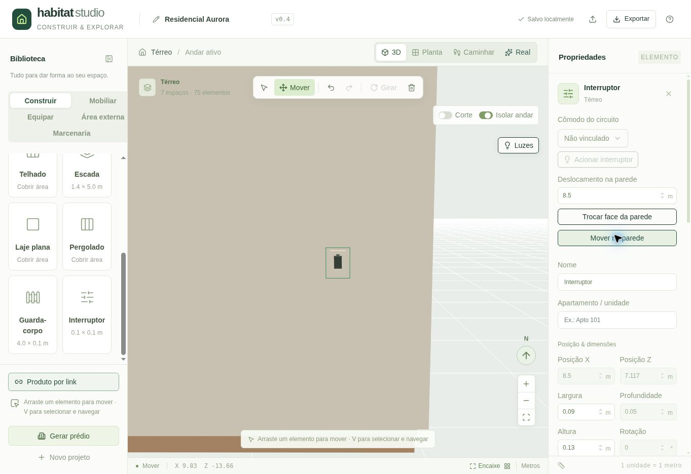

# Habitat Studio

[Open the web app](https://habitat-studio.plcm90902.chatgpt.site)

A web-based 3D building editor. Draw rooms and walls, furnish individual apartments, create multiple floors, and walk through your own building.



## Features

- Metric 3D editor and orthographic floor plan, with a 0.25 m snapping grid.
- Wall and room drawing. A room tool creates a floor slab and four walls.
- Hosted doors and windows: openings are cut in the wall geometry. Doors remain open for walkthroughs.
- Gabled roofs, stairs, sofas, armchairs, beds, tables, chairs, cabinets, plants, lamps, refrigerators, stoves, sinks, and toilets.
- Property inspector for names, apartment grouping, position, rotation, dimensions, and colors.
- Floor isolation and wall cutaway; empty and duplicated floors.
- A generated residential building with two apartments per floor, room partitions, furniture, stairs, and a roof.
- First-person exploration with wall/furniture collision and traversable stairs.
- Undo/redo, browser-local autosave, validated JSON import/export.
- Click-and-drag mouse look, keyboard look, and touch movement controls. Releasing the left mouse button immediately stops turning; the cursor stays available.
- A compact walking-mode mouse sensitivity slider (25–200%), remembered in the current browser.
- Automatic lightweight SVG compatibility rendering when WebGL is unavailable. WebGL is the preferred renderer.

## v0.2 — Houses, outdoor areas and product links

- Editable furnished house with a 24 × 30 m lot, lawn, paved access/patio, pool, trees, fence and open gate.
- Outdoor catalog: draw lots, lawns, paving and pools; draw fences between two points; place gates and trees.
- **Produto por link** reads public storefront pages through a server endpoint and extracts the product name, reference photo and explicit width/height/depth. It supports Product JSON-LD, labelled specifications, VTEX/Next product data and explicit combined axis orders.
- Review measurements in centimeters before placement; preview a proportional 3D model and position it at the confirmed metric scale. The source link and original confirmed dimensions survive local saving and JSON export/import.
- If a page cannot be read, copy its specifications for automatic text extraction or enter measurements yourself. Missing units, ambiguous axis orders and dimension ranges are not guessed.
- Product geometry is a procedural representation of the chosen category, with exact outer bounds. A product URL does not itself provide a manufacturer 3D model. Exact glTF/GLB import is a future feature.
- Better full-project framing and layered outdoor surfaces in the SVG renderer. Outdoor landscaping is kept on the original floor when duplicating floors.


## v0.3 — Penthouse, expanded catalog and Real mode

- **Adicionar cobertura** adds an editable top floor with either a furnished apartment and terrace or an open terrace. It replaces only the previous top floor's gabled roof, preserves the lower floors, and connects the terrace with a stair shaft and continuous landing. Perimeter railings, a pergola and outdoor furniture are included. Automatic layouts accept footprints from 8 × 9 m to 60 × 60 m; other shapes can be built manually.
- Structure catalog adds a flat roof slab, pergola and railing. Outdoor furniture and plants can be placed on the active upper floor.
- Eight new appliances: microwave, washing machine, dryer, dishwasher, built-in oven, cooktop, range hood and air conditioner. **Marcenaria** contains eight items: cabinet, base cabinet, wall cabinet, drawer unit, bookshelf, wardrobe, slatted panel and countertop.
- **Elevação** positions objects above their assigned floor, including wall cabinets, hoods and air conditioners. Color and finish can be edited separately; finish choices are automatic, wood, stone, fabric, metal and paint. All dimensions, elevations and finish choices survive JSON export/import.
- **Real** enters first-person exploration of the same document with PBR surface maps, bump detail, reflections, shadows, day/night lighting and room lights. **Editar** returns to the editor without changing the project. Walking retains click-and-drag look, adjustable sensitivity, collision, stair access and floor shortcuts.
- This is an initial real-time visualization using procedural geometry, not a photographic reconstruction. Enhanced surface maps, reflections and shadows require WebGL; the compatibility renderer shows a simplified view and a clear notice. No external asset services or API keys are required.


## v0.4 — Lights and visible switches

- **Luzes** opens per-floor room controls: switch individual rooms or all rooms on/off, set intensity from 0–200%, and choose a light color. The same controls are available in a selected room or light fixture's inspector.
- New **Interruptor** and **Plafon** catalog entries. Place a switch on a wall and select its room circuit; ceiling lights and floor lamps join their containing room automatically, with an editable circuit assignment.
- New house/building starters and generated penthouses include ceiling lights and visible switches. Existing saved projects remain intact: choose **Luzes → Instalar luzes e interruptores** on each desired floor to add missing fixtures. Installing twice does not duplicate them.
- During walking or Real mode, click a visible switch within 2.5 m, aim at it and press **E**, or use its on-screen action. Walls and furniture block activation. Dragging over a switch turns the camera without toggling it.
- Room power gates all its assigned fixtures; individual fixture power remains independent. Light intensity, color and circuit assignments persist through autosave, undo/redo and JSON import/export. Switching lights preserves the player's position and viewing direction.
- Real mode renders up to 16 active light sources on the player's current floor. WebGL provides the full lighting effects; SVG compatibility lighting is approximate and lacks occlusion and shadows.




### Precise wall-switch placement

Choose **Interruptor**, then click a free wall face. The editor opens full-height walls and uses the actual surface hit instead of the floor projection; a green preview shows the mounting position. The switch faces the clicked side and stays flush with the wall. Door/window openings reject placement rather than moving the switch to an unrelated position. A bare wall can hold an unlinked switch; assign its circuit in Properties.

Select an installed switch and choose **Mover na parede** to view its face closely. Drag horizontally or vertically to slide it and change height while keeping the wall attachment. **Encaixe** uses 5 cm increments for switches. **Deslocamento na parede**, **Elevação** and **Trocar face da parede** provide precise adjustments. Switch yaw follows the wall automatically; wall thickness changes and switch duplication also preserve mounting. Existing displaced switches are re-seated when moved or adjusted.



## Moving objects

Hold an object briefly before dragging in 3D or floor-plan view. The **Mover** tool is also available directly in the viewport toolbar. The camera stays fixed during object movement; empty-space drags in selection mode navigate.


## Rotating objects

Select a free object in 3D or floor-plan view and drag its circular rotation handle. The camera stays fixed. **Encaixe** snaps rotation to 15°; hold Shift or disable Encaixe for free rotation. Release to commit one undo entry, or Esc to cancel. The **Girar** toolbar button and **R** turn 90°; the property inspector accepts an exact angle. A focused handle also supports arrow keys (15°, or 1° with Shift). Hosted doors/windows follow their wall's rotation.


## Run locally

Requires Node.js 22.15+ and pnpm 11+. No API keys or paid services are required.

```sh
corepack enable
pnpm install
pnpm dev
```

Open the address printed by the development server. The application runs in a browser; there is no desktop client.

```sh
pnpm typecheck
pnpm lint
pnpm test
pnpm build
```

The included Vinext configuration uses React, TypeScript, Three.js, and Vite with Next.js App Router conventions. The UI and 3D engine execute on the client; the server serves the application shell and imports public product pages. The standard build targets Cloudflare Workers.

## How to use

1. Open the included **Residencial Aurora** example or choose **Novo projeto** for a furnished house, a building, a lot, or a blank project.
2. Select **Parede**, **Cômodo**, or **Telhado**, then click two points in the viewport.
3. Select **Porta** or **Janela** and click a wall on the active floor.
4. Choose a furniture/appliance item and click the floor. Press **R** to rotate before placement.
5. Select an object to change its meter coordinates, dimensions, color, name, or apartment. Hold the primary mouse button over it for 450 ms, then drag to move. Moving immediately keeps camera navigation. Alternatively choose **Mover** (**M**) to drag without waiting; **V** returns to selection. Release to commit, or press **Esc** to cancel. A move creates one undo entry. Doors/windows slide along their host wall.
6. Use the floors panel to add, duplicate, or select a floor. **Gerar prédio** creates one to eight furnished floors; **Adicionar cobertura** adds an apartment with terrace or an open terrace above the current top floor.
7. Switch to **Caminhar** to enter the active floor or selected room, or **Real** for enhanced materials and **Dia/Noite** lighting. Use **WASD** to walk and **Shift** to move faster. Hold the left mouse button and drag to look; release it to stop turning. Arrow keys also look around. Adjust **Sensibilidade** in the lower-right corner (25–200%). Stairs connect floors; the floor buttons provide direct access. **Editar** returns from Real mode.
8. Use **Exportar** to back up the project or move it to another browser.

| Shortcut | Action |
| --- | --- |
| V | Selection and camera navigation |
| M | Move tool (drag immediately) |
| R | Rotate selected object or placement preview by 90° |
| Delete / Backspace | Delete selected object |
| Ctrl/Cmd + Z | Undo |
| Ctrl/Cmd + Shift + Z | Redo |
| Ctrl/Cmd + S | Save in the current browser |
| Esc | Cancel object movement / rotation / drawing / stop camera drag |
| E | Activate the visible nearby switch in walking mode |
| WASD | Walk |
| Shift | Walk faster |
| Arrow keys | Look around in walking mode |

## Architecture

- `lib/habitat/domain.ts`: versioned document schema, generators, hosted openings, collision, movement and floor support. Independent of rendering and React.
- `lib/habitat/models.ts`: procedural 3D geometry and material/resource lifecycle.
- `lib/habitat/penthouse.ts`: nonmutating top-floor generation, terrace slabs and stair openings.
- `lib/habitat/real-materials.ts`: shared numeric PBR surface maps and geometry-preserving finish application.
- `lib/habitat/lighting.ts`: room circuits, fixture generation and lighting state.
- `lib/habitat/light-interaction.ts`: nearby-switch visibility and range checks.
- `lib/habitat/engine.ts`: cameras, orbit and walking controls, picking, previews and renderers.
- `lib/habitat/object-move.ts`: gesture arbitration, grid snapping and hosted-opening constraints.
- `lib/habitat/object-rotate.ts`: continuous dial angles, wraparound and optional rotation snapping.
- `lib/habitat/walk-controls.ts`: primary-pointer drag ownership and normalized mouse/touch sensitivity.
- `components/habitat/Studio.tsx`: editor actions, history, property panels and persistence.
- `components/habitat/Viewport.tsx`: client-side renderer lifecycle and graceful failure handling.
- `tests/domain.test.mjs`: meaningful regression coverage for geometry references, collision, stairs, imports, and floor cloning.
- `tests/walk-controls.test.mjs`: regression coverage for mouse hover/release, pointer ownership, cancellation, sensitivity, and touch look.

See [docs/ARCHITECTURE.md](docs/ARCHITECTURE.md) and [docs/ROADMAP.md](docs/ROADMAP.md).

## Current boundaries

This is a first usable prototype, not a professional CAD/BIM system. Models use procedural low-poly geometry. Room walls do not automatically merge with neighboring rooms; walls and floor slabs are independent editable objects. The apartment field groups objects but does not enforce physical containment. Roofs use a simple gable profile with a fixed base at 2.95 m above their assigned floor. Stairs follow a continuous support ramp matching their visible steps, without gravity, jumping, or head collision. There is no structural engineering calculation, DXF/IFC import, photorealistic asset library, cloud account, shared project storage, or collaboration yet.

Browser-local data can disappear if site data is cleared. JSON export is the portable backup format. Large buildings are bounded by 20 floors and 5,000 entities; the SVG compatibility renderer has less visual fidelity and lower performance than WebGL.
