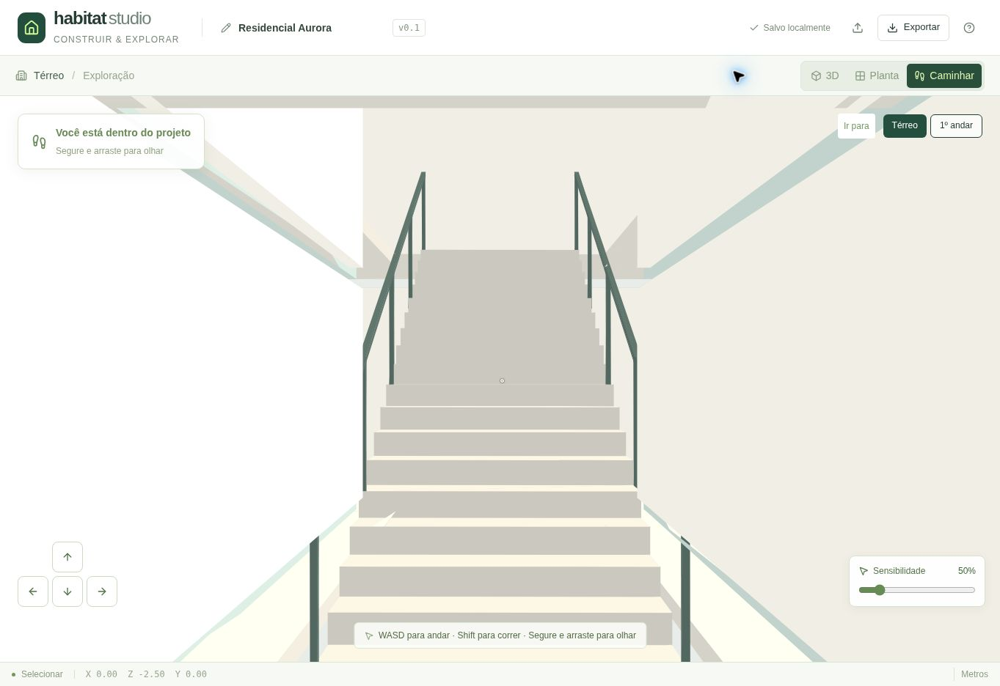
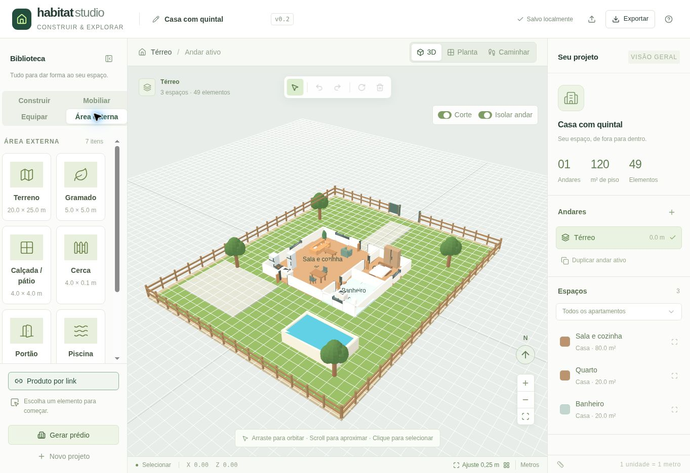
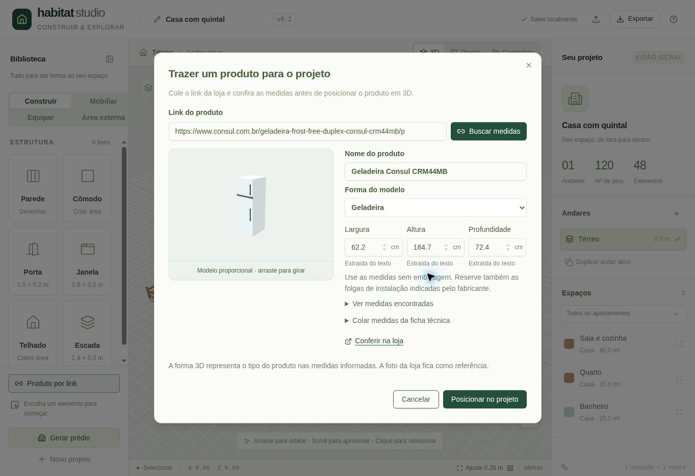
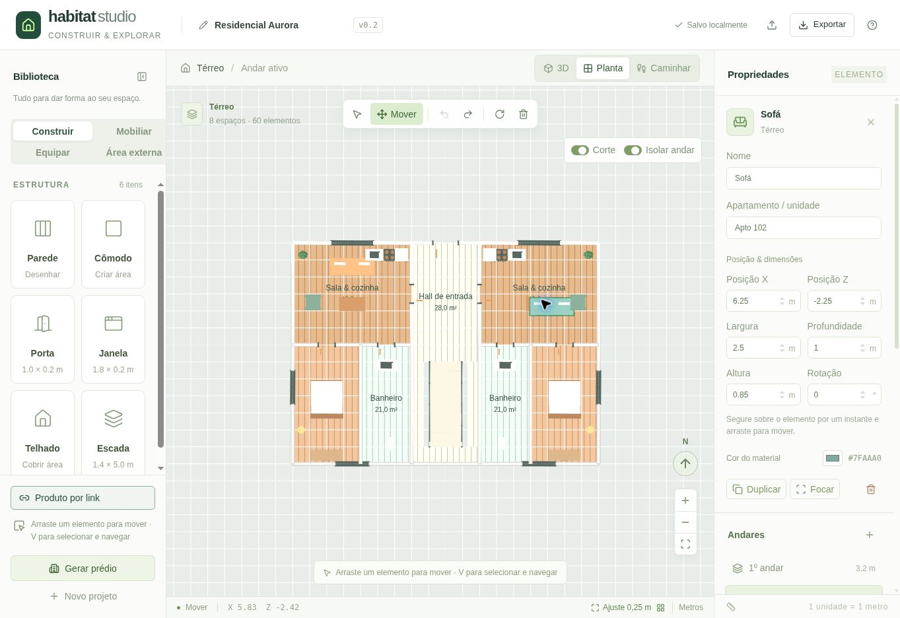
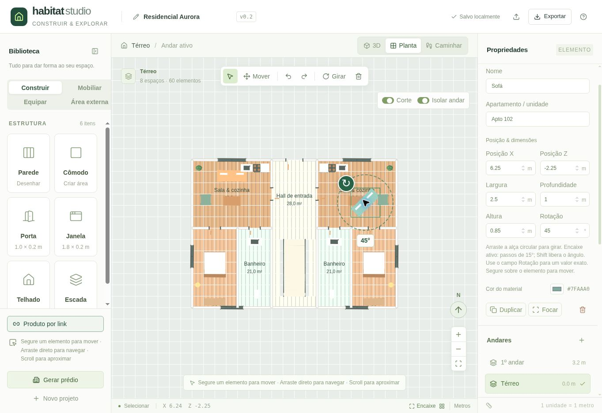
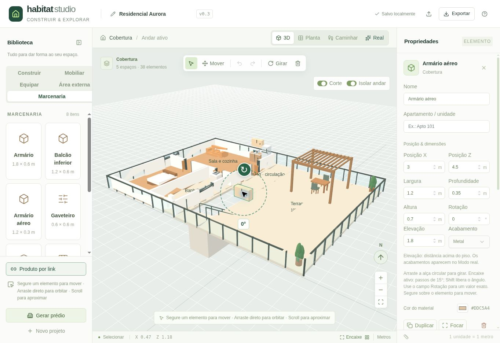
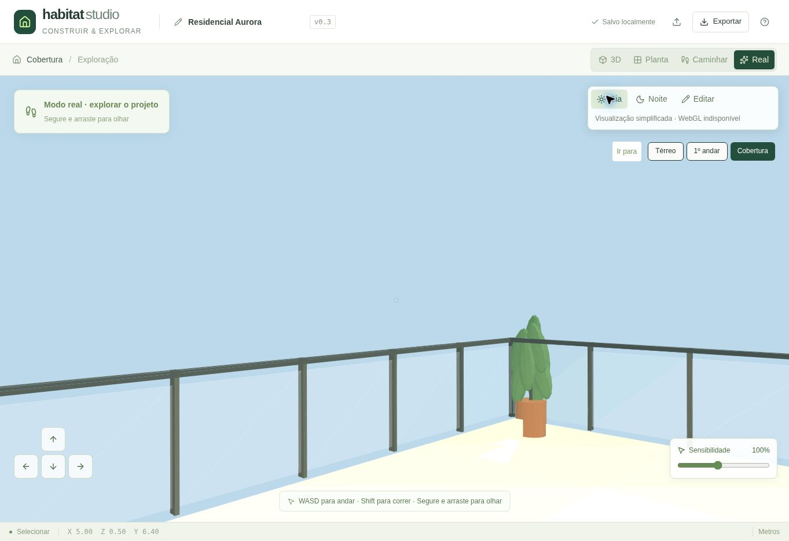

# v0.1 verification

## Automated

Eight domain regression tests pass: building generation and JSON round-trip; rotated wall/door collision; window barriers and opening overlap rejection; hosted openings after wall transformations/deletion; stair ascent/descent and prevention of upper-floor teleportation; floor duplication; malformed project rejection; and room bounds/spawn collision avoidance.

TypeScript checking and ESLint pass for the application, editor and engine.

Five walking-input regression tests also cover: no turning on hover or after release; primary-left-button ownership; cancellation and a fresh drag origin; live sensitivity changes and validation; and touch release.

## Browser

Verified on the desktop internal preview:

- The procedural residential building renders in both orbit view and orthographic floor plan.
- A room in Apto 101 can be renamed while Apto 102 preserves its original name.
- Undo and redo restore the visible document.
- Furniture placement snaps to 0.25 m; deletion, undo and redo update the scene.
- The room drawing tool creates a slab and four walls from two clicks.
- Walking mode displays the building interior.
- Direction buttons move the player; the visible coordinates update.
- Direct access to the upper floor sets the player's feet to 3.20 m.
- Browser-local autosave displays its saved state.
- Walking camera turns during a primary-button drag, then stays unchanged after release and cursor repositioning with a click. Verified against the rendered SVG geometry.
- The sensitivity slider changes between 25% and 200%; a 50% setting survives page reload and re-entering walking mode.

## Scope of verification

The test browser has WebGL disabled. Visual and UI checks therefore exercised the real SVG compatibility renderer; hardware-accelerated WebGL rendering remains to be checked on a GPU-enabled browser. Held-key/touch input requires interactive verification. The standard desktop preview does not offer a viewport-resize capability, so mobile layout was reviewed in source only. Mouse look now uses primary-button drag rather than pointer lock; input ownership and sensitivity are covered by automated tests.

The test context did not expose registered WebMCP tools. The optional bridge is feature-detected, but its registration/runtime integration could not be verified here. JSON structure/round-trip validation is automated; browser download/import permission handling still requires manual verification.

# v0.2 verification

The end-to-end story is: choose a house/lot → customize outdoors → paste a product link → read/review dimensions → inspect a proportional model → place it at metric scale → reload/save the project.

## Automated

22 tests pass (the original 13 plus nine product/outdoor cases). Added checks cover decimal/imperial conversion; structured product dimensions separated from shipping dimensions; unpackaged storefront specifications; explicit combined axis orders; unsafe URL/DNS targets; redirect/body-size validation; house/terrain generation and exterior collision; exact imported-model bounds and persisted product metadata; and copied specification text with punctuation and units in labels.

A freshly downloaded real Consul CRM44MB product page was parsed successfully: width 62.2 cm, height 184.7 cm and depth 72.4 cm, using labelled measurements without packaging. The product name, brand and reference photo were also extracted. These dimensions were used in the UI preview and placement check.

## Browser

Verified the house starter, seven outdoor catalog entries, complete-lot framing, and layered ground rendering. The product import request reached the API, and its error state kept manual review available. In the restricted agent preview, the outbound DNS request could not complete; successful automatic remote lookup was not claimed from this preview.

Copied specification text populated all three centimeter fields, created the proportional 3D preview, and enabled placement. Clicking the floor inserted a fridge at 0.622 × 1.847 × 0.724 m and retained the source link. After reload, the project retained 49 entities and the inspector displayed those exact measures. The inspector no longer rounds imported dimensions on focus/blur. Source classification clearly identifies copied/manual measurements.

The browser uses the SVG compatibility renderer. GPU rendering and physical mobile/touch behavior remain outside this verification. The browser download event did not expose the exported file; JSON round-trip and metadata preservation are covered by automated tests instead.

## Published API

A direct authenticated request to the deployed `/api/products/import` endpoint returned HTTP 200 for the real Consul CRM44MB link. It returned the expected product name, fridge category, explicit unpackaged evidence, and dimensions `{width:62.2,height:184.7,depth:72.4}` in centimeters. This verified the production API → public DNS → storefront HTML → extraction → JSON boundary. No credentials are sent to the storefront. The earlier preview DNS failure was specific to the restricted preview runtime.

The generated house rear doorway was moved to keep the kitchen counter out of the circulation path. The regression check walks continuously from the living room through that doorway into the yard.

# Object movement update

## Automated

26 tests pass. Four additional regressions cover quick navigation versus hold/jitter, primary-button ownership and modifier/cancel/reset behavior, optional snapping and bounds without altering imported dimensions or provenance, and rotated-wall opening constraints and hosted-wall translation. TypeScript, targeted ESLint and the production build pass.

## Browser

Verified in the supervised SVG preview:

- A held click on a sofa selects it without displacement or a history entry.
- The Move toolbar button moves the sofa from (5.5, -4.6) to (4.5, -3.25), on the 0.25 m grid; rendered room-label transforms stay identical, confirming a fixed camera.
- One undo restores the original position; redo restores the moved position.
- A held drag in selection mode moves the sofa again to (6.25, -2.25), preserving camera transforms.
- Reload retains the sofa coordinates and dimensions.
- Empty-space dragging pans the floor-plan camera after fixing its left-button mapping.
- Moving a wall in 3D changes its position while camera-label transforms stay unchanged; undo restores it.
- The Move toolbar label, inline guidance and property inspector remain visible and legible.

Fast pre-hold movement and cancellation are covered by the gesture tests; the browser automation uses a held drag. Hardware-accelerated WebGL, physical touch gestures and keyboard cancellation during a continuously held mouse press still need an interactive device check.

# Object rotation update

## Automated

29 tests pass. Three new cases cover click/jitter preservation, center rejection, exact versus 15° angles, normalization and continuous wraparound; wall rotation preserves hosted opening offsets and valid references; imported furniture retains positions, dimensions and product metadata. TypeScript passes. Production packaging is checked by the publishing workflow.

## Browser

Verified in the supervised SVG preview:

- Dragging the sofa's handle in plan view changed 0° to 270°, with identical rendered room-label transforms (fixed camera).
- A single undo restored 0°; redo restored 270°. Position and dimensions stayed unchanged.
- ArrowLeft changed 270° to 285°; Shift+ArrowRight changed 285° to 284°.
- Handle dragging in perspective 3D changed 284° to 180°, with identical camera-label transforms.
- Reload retained 180° and the original position/dimensions.
- The exact angle field accepted 45°; the visible Girar button changed it to 135° and undo restored 45°.
- The selected-object ring, degree label, visible Girar toolbar button, Encaixe control and property instructions are legible together.

Cancellation paths were reviewed in the event lifecycle; continuously held pointer cancellation, physical touch and hardware WebGL were not exercised by this browser check.

# v0.3 verification

## Automated

34 tests pass. The five new cases exercise apartment/open-terrace generation without mutating the source or lower floors; valid JSON round-trips and top-roof replacement; continuous stair ascent/descent plus bidirectional apartment/terrace doorway passage; unsupported footprints and floor limits; all 16 new-appliance/woodwork categories with exact imported bounds, suspended-object collision and product-name classification; and geometry-preserving Real materials, explicit finish overrides and shared texture disposal. TypeScript passes. The publishing workflow verifies the production build and package.

## Browser

Verified on the supervised preview with the SVG compatibility renderer:

- Adding an apartment with terrace creates a third floor at 6.40 m, with 37 new-floor entities and 157 total entities in the starter building. One undo restores the original two-floor project; adding again recreates the coverage.
- Marcenaria has eight usable options; Equipar has twelve, including the eight added appliances.
- Placing an aerial cabinet on the terrace starts at 1.50 m above the active floor. The inspector accepts 1.80 m and Metal finish.
- Real enters first-person exploration, keeps the current floor and exposes Dia/Noite, Editar, direct floor access and sensitivity controls. Changing day/night visibly changes the sky and lighting; holding a movement button changes player coordinates. Pointer dragging changes the camera view.
- Returning to edit and reloading retains the three-floor document, the placed cabinet and its elevation/finish.

WebGL is unavailable in the test browser. Its notice is visible in Real mode; GPU textures, bump detail, reflections and shadows were reviewed in code but were not visually verified here. This is a first real-time presentation of procedural models, not a claim of photographic reconstruction. Physical mobile/touch checks remain pending.

